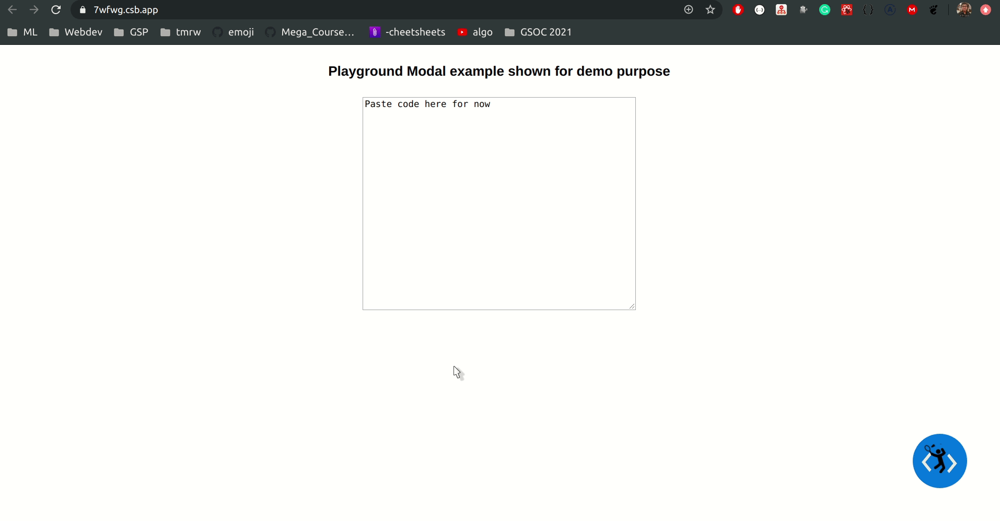

## embed-play-into-docs

- Using only two components here
  - Avatar Playground
  - Card playground

Imported from root lib/index.js file

```js
import AvatarPlayground from "./content/Avatar/avatar.playground";
import CardPlayground from "./content/Card/card.playground";

export default {
  AvatarPlayground,
  CardPlayground,
};
```

## Peek a boo!



### This is the repo to mimic basic required functionality of playground

- add content folder with two index and two respective playground file
- add components folder with one component file
- add containers folder as in playground
- publish to npm

### make Publishable

- [x] add prettier husky
- [x] add eslint - basic only
- [x] export all playgrounds from content/index.js = entry point of library.

  - [x] write a script to import all the playgrounds from content directory and export them out automatically into lib folder(copy content.jsx to lib.jsx)

  - [x] publish lib folder onto npm.
  <!-- Publish/Republish -->
  - [x] run yarn build
  - [x] update version in package.json
  - [x] npm publish
  <!-- Inside mimics docasaurus -->
  - [x] yarn upgrade embed-play-into-docs

## Stretch

- [ ] add test with jest and react-testing library
- [ ] add eslint all features

## mimic-elements-docs-docasaurus

- mimic elements folder here
- import published playgrounds here
- create a button
- create a modal
- interpolate modal with playground
